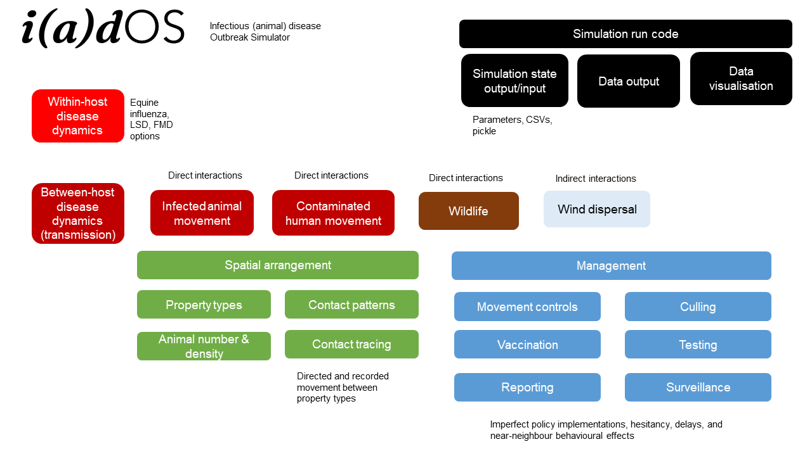

# infectious animal disease Outbreak Simulator (iadOS)
For ARDC-HASTE project

**Code written by Isobel Abell and Thao P. Le**
(base code and FMD_modelling module written by Isobel Abell, and adapted by Thao P. Le)

**FMD_modelling** folder: submodule containing infectious disease spread code

**simulator** folder: containing this-project-specific elements of the simulation code, including spatial system setup, any modified infectious disease components, management actions etc.

**scenarios** folder: contains the code that calls the simulation code

**tests** folder: should contain tests (hah)

