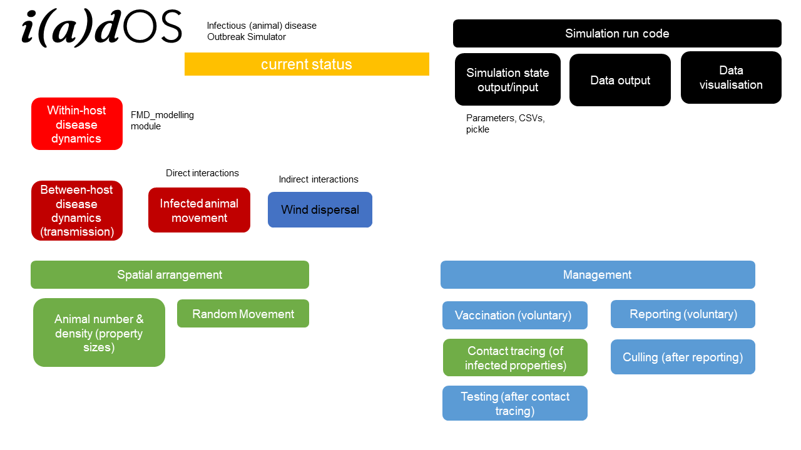
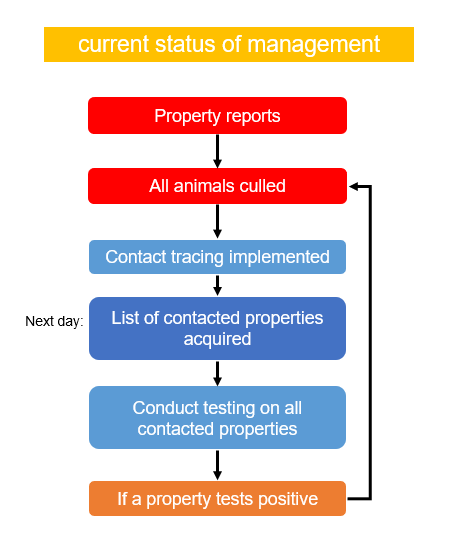
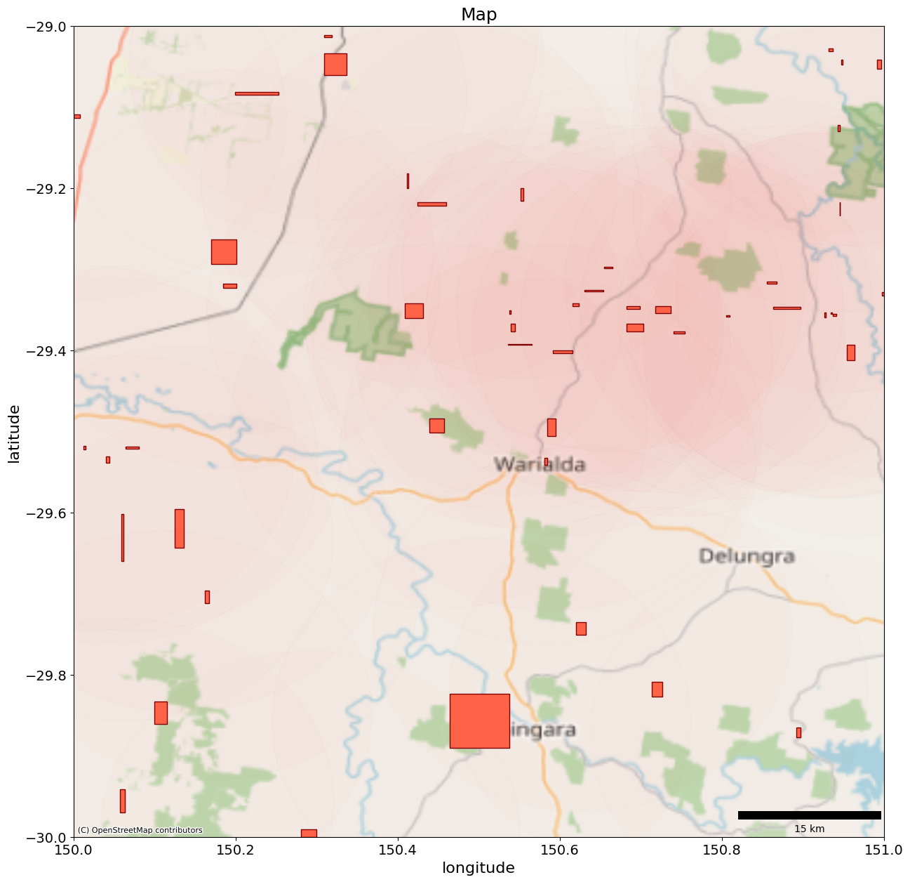
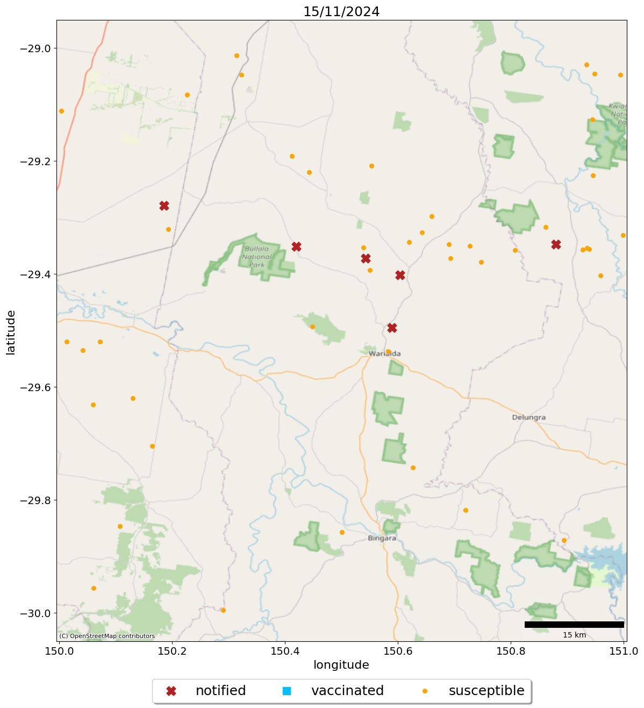

# infectious animal disease Outbreak Simulator (iadOS)

Infectious animal disease outbreak simulator for [Enhancing Models for Rapid Decision-Support in Emergency Animal Disease Outbreaks (HASTE)](https://ardc.edu.au/project/enhancing-models-for-rapid-decision-support-in-emergency-animal-disease-outbreaks/) project. The aim of this simulator is to simulate a realistic scenario and data that could be recorded during an emergency animal disease outbreak, which is then used as part of decision making.

**Code written by Thao P. Le and Isobel Abell**
(base code and FMD_modelling module written by Isobel Abell, and adapted by Thao P. Le)

**FMD_modelling** folder: submodule containing infectious disease spread code

**simulator** folder: containing this-project-specific elements of the simulation code, including spatial system setup, any modified infectious disease components, management actions etc.

**scenarios** folder: contains the code that calls the simulation code

**tests** folder: contains some tests

# Outbreak simulator workflow (v0.2)

**The main steps**:
1. Initiate map
2. Seed infection
3. Undetected spread: Run time forward until first report
4. Management stage: including default management (contract tracing local movement restrictions, clinical examination, lab testing and culling) and additional management options (large-scale movement restrictions, testing, vaccination, ring culling, and their combinations)
5. Final outputs (total number of cases etc.)

The main file that produced the outputs for the December 2024 Trial simulation exercise (v0.2) is [**maincontrol_trial.py**](scenarios/maincontrol_trial.py).

<!--# Planned outbreak simulator

 
 -->

<!-- # Current state

(note that this management process png is no longer up to date...)

# Example outputs

 -->
